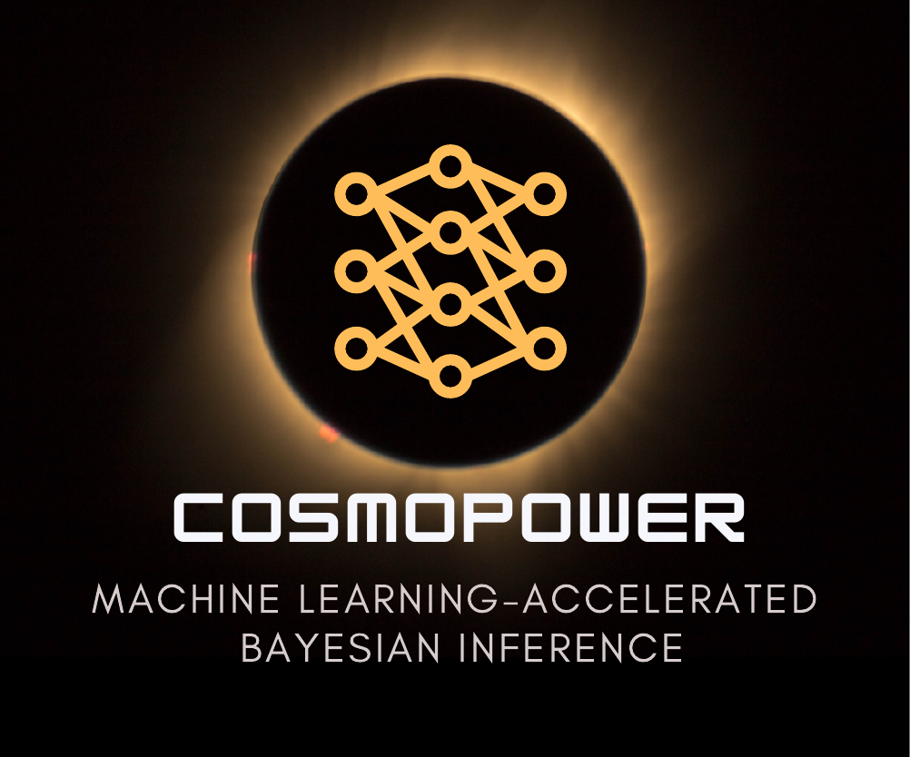

``CosmoPower`` is a library for Machine Learning - accelerated Bayesian inference. While the emphasis is on building algorithms to accelerate Bayesian inference in *cosmology*, the interdisciplinary nature of the methodologies implemented in the package allows for their application across a wide range of scientific fields. The ultimate goal of ``CosmoPower`` is to solve _inverse_ problems in science, by developing Bayesian inference pipelines that leverage the computational power of Machine Learning to accelerate the inference process. This approach represents a principled application of Machine Learning to scientific research, with the Machine Learning component embedded within a rigorous framework for uncertainty quantification.

In cosmology, ``CosmoPower`` aims to become a fully _differentiable_ library for cosmological analyses. Currently, ``CosmoPower`` provides neural network emulators of matter and Cosmic Microwave Background power spectra. These emulators can be used to replace Boltzmann codes such as [CAMB](https://github.com/cmbant/CAMB) or [CLASS](https://github.com/lesgourg/class_public) in cosmological inference pipelines, to source the power spectra needed for two-point statistics analyses. This provides orders-of-magnitude acceleration to the inference pipeline and integrates naturally with efficient techniques for sampling very high-dimensional parameter spaces. The power spectra emulators implemented in CosmoPower, and first presented in its [release paper](https://arxiv.org/abs/2106.03846), have been applied to the analysis of real cosmological data from  experiments, as well as having been tested against the accuracy requirements for the analysis of next-generation cosmological surveys.

``CosmoPower`` is written entirely in [Python](https://www.python.org/). Neural networks are implemented using the [TensorFlow](https://www.tensorflow.org/) library.
