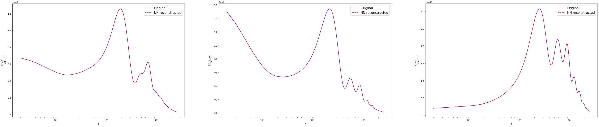
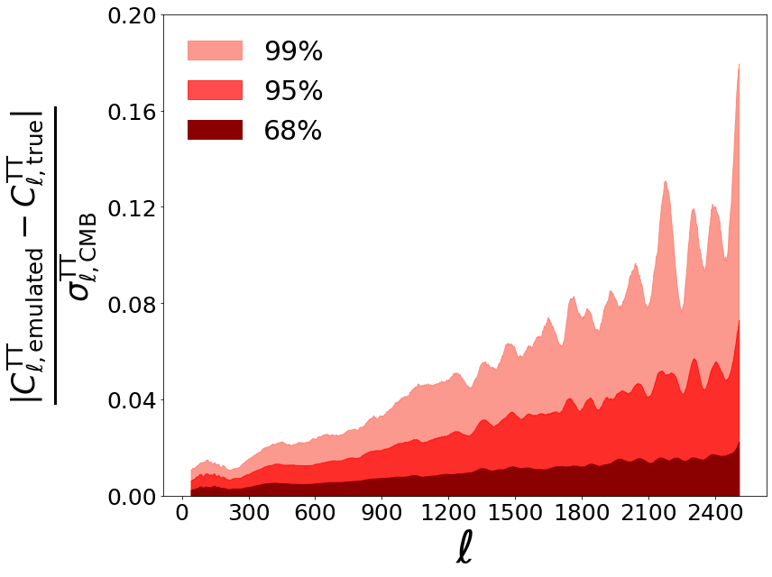

This section is an excerpt from the notebook explaining how to [train a ``cosmopower_NN`` model](https://github.com/alessiospuriomancini/cosmopower/blob/main/notebooks/training_notebooks/cosmopower_NN_CMB_training.ipynb). The user is strongly encouraged to run that notebook in its entirety, [](https://colab.research.google.com/drive/1eiDX_P0fxcuxv530xr2iceaPbY4CA5pD?usp=sharing). Here we will consider only the most important parts to understand how the training works.


#### **PARAMETER FILES**

Let's take a look at the content of the parameter files that are read by ``CosmoPower`` during training.

```py
training_parameters = np.load('./camb_tt_training_params.npz')
```

`training_parameters` is a `dict` of `np.arrays`. There is a `dict` key for each of the parameters the emulator will be trained on:


```py
print(training_parameters.files)
```

    ['omega_b', 'omega_cdm', 'h', 'tau_reio', 'n_s', 'ln10^{10}A_s']


Each of these keys has a `np.array` of values: the number of elements in the array is the number of training samples in our set. For example:


```py
print(training_parameters['omega_b'])
print('number of training samples: ', len(training_parameters['omega_b'])) # same for all of the other parameters
```

    [0.03959524 0.03194429 0.03467569 ... 0.03958164 0.02816863 0.01942146]
    number of training samples:  42614


#### **FEATURE FILES**

Now let's take a look at the "features". With features here we refer to the predictions of the neural network: these may be spectra or log-spectra values. For example, in [this notebook](https://github.com/alessiospuriomancini/cosmopower/blob/main/notebooks/training_notebooks/cosmopower_NN_CMB_training.ipynb) we are emulating values of the TT log-power spectra. These are sampled at each multipole $\ell$ in the range $[2, \dots 2508]$, hence our training sample for each log-spectrum will be a 2507-dimensional array. The corresponding `.npz` files contain a `dict` with two keys:


```py
training_features = np.load('./camb_tt_training_log_spectra.npz')
print(training_features.files)
```

    ['modes', 'features']


The first key, `modes`, contains a `np.array` of the sampled Fourier modes (multipoles, in this CMB case):


```py
print(training_features['modes'])
print('number of multipoles: ', len(training_features['modes']))
```

    [   2    3    4 ... 2506 2507 2508]
    number of multipoles:  2507


The second key, `features`, has values equal to the actual values of the log-spectra. These are collected in a `np.array` of shape (number of training samples, number of Fourier modes):


```py
training_log_spectra = training_features['features']
print('(number of training samples, number of ell modes): ', training_log_spectra.shape)
```

    (number of training samples, number of ell modes):  (42614, 2507)


The files for the testing samples have the same type of content.

```py
testing_params = np.load('./camb_tt_testing_params.npz')
testing_spectra = 10.**(np.load('./camb_tt_testing_log_spectra.npz')['features'])
```

### **`cosmopower_NN` INSTANTIATION**

We will now create an instance of the `cosmopower_NN class`. 

In order to instantiate the class, we need to first define some of the key aspects of our model.

#### **PARAMETERS** 

Let's start by defining the parameters of our model. `cosmopower_NN` will take in input a set of these parameters for each prediction. 

If, for example, we want to emulate over a set of 6 standard $\Lambda$CDM parameters,

$\omega_{\mathrm{b}}, \omega_{\mathrm{cdm}}, h, \tau, n_s, \ln10^{10}A_s$

we need to create a `list` with the names of all of these parameters, in _arbitrary_ order:     


```py
model_parameters = ['h', 
                    'tau_reio', 
                    'omega_b', 
                    'n_s', 
                    'ln10^{10}A_s', 
                    'omega_cdm', 
                    ]
```

This `list` will be sent in input to the `cosmopower_NN` class, which will use this information: 

- to derive the *number* of parameters in our model, equal to the number of elements in `model_parameters`. This number also corresponds to the number of nodes in the input layer of the neural network;

- to free the user from the burden of having to manually perform any ordering of the input parameters.

The latter point guarantees flexibility and simplicity while using `cosmopower_NN`: to obtain predictions for a set of parameters, the user simply needs to feed a Python `dict` to `cosmopower_NN`, without having to worry about the ordering of the input parameters. 

For example, if I wanted to know the neural network prediction for a single set of parameters, I would collect them in the following `dict`:

```py
example_single_set_input_parameters = {'n_s': [0.96], 
                                       'h': [0.7], 
                                       'omega_b': [0.0225], 
                                       'omega_cdm': [0.13], 
                                       'tau_reio': [0.06], 
                                       'ln10^{10}A_s': [3.07], 
                                        }
```

Similarly, if I wanted to ask `cosmopower_NN` for e.g. 3 predictions, for 3 parameter sets, I would use:

```py
example_multiple_sets_input_parameters = {'n_s': np.array([0.96, 0.95, 0.97]), 
                                          'h': np.array([0.7, 0.64, 0.72]), 
                                          'omega_b': np.array([0.0225, 0.0226, 0.0213]), 
                                          'omega_cdm': np.array([0.11, 0.13, 0.12]), 
                                          'tau_reio': np.array([0.07,0.06, 0.08]), 
                                          'ln10^{10}A_s': np.array([2.97, 3.07, 3.04]), 
                                           }
```
The possibility of asking `cosmopower_NN` for batch predictions, in particular, makes it a particularly useful tool to integrate within samplers that allow for batch evaluations of the likelihood.

#### **MODES**

A second, important piece of information for the `cosmopower_NN` class is the number of its output nodes, which corresponds to the number of sampled Fourier modes in our (log)-spectra, i.e. the number of multipoles $\ell$ for the CMB spectra, or the number of $k$-modes for the matter power spectrum.

In the example of [this notebook](https://github.com/alessiospuriomancini/cosmopower/blob/main/notebooks/training_notebooks/cosmopower_NN_CMB_training.ipynb), we will emulate all of the $\ell$ multipoles between 2 and 2508. Note that we exclude $\ell=0,1$ as these are always 0. We can read the sampled $\ell$ range from the `modes` entry of our `training_features` dict (previously loaded):


```py
ell_range = training_features['modes']
print('ell range: ', ell_range)
```

    ell range:  [   2    3    4 ... 2506 2507 2508]


#### **CLASS INSTANTIATION**
Finally, let's feed the information on model parameters and number of outputs to the `cosmopower_NN`class, which we instantiate with the following:


```py3
from cosmopower import cosmopower_NN

cp_nn = cosmopower_NN(parameters=model_parameters, 
                      modes=ell_range, 
                      n_hidden = [512, 512, 512, 512], # 4 hidden layers, each with 512 nodes
                      verbose=True, # useful to understand the different steps in initialisation and training
                      )
```

    
    Initialized cosmopower_NN model, 
    mapping 6 input parameters to 2507 output modes, 
    using 4 hidden layers, 
    with [512, 512, 512, 512] nodes, respectively. 
    


### **TRAINING**

This section shows how to train our model. 

To do this, we will call the method `train()` from the `cosmopower_NN` class.
Here are the input arguments for this function:

* `training_parameters`: as explained above, this is a `dict` of `np.arrays` of input parameters. Each `dict` key has a `np.array` of values, for example

```py
training_parameters = {`omega_b` : np.array([0.0222, 0.0213, 0.0241, ...]),
                       `omega_cdm` : np.array([0.114, 0.134, 0.124, ...]),
                        ... etc ...
                      }
```
(each `np.array` has the same number of elements, equal to the number of training samples);

* `training_features`: a `np.array` of training (log)-power spectra. Its dimensions are (number of training samples, number of Fourier modes);

* `filename_saved_model`: path (without suffix) to the `.pkl` file where the trained model will be saved;

* `validation split`: `float` between 0 and 1, percentage of samples from the training set that will be used for validation.


Some of the input arguments allow for the implementation of a learning schedule with different steps, each characterised by a different learning rate. In addition to the learning rate, the user can change other hyperparameters, such as the batch size, at each learning step:

* `learning_rates`: `list` of `float` values, the optimizer learning rate at each learning step;

* `batch_sizes`: `list` of `float` values, batch size for each learning step;

* `gradient_accumulation_steps`: `list` of `int` values, the number of accumulation batches if using gradient accumulation, at each learning step. Set these numbers to > 1 to activate gradient accumulation - only worth doing if using very large batch sizes;

* `patience_values`: `list` of `int` values, the number of epochs to wait for early stopping, at each learning step;

* `max_epochs`: `list` of `int` values, the maximum number of epochs for each learning step.


```py
with tf.device(device):
    # train
    cp_nn.train(training_parameters=training_parameters,
                training_features=training_log_spectra,
                filename_saved_model='TT_cp_NN_example',
                # cooling schedule
                validation_split=0.1,
                learning_rates=[1e-2, 1e-3, 1e-4, 1e-5, 1e-6],
                batch_sizes=[1024, 1024, 1024, 1024, 1024],
                gradient_accumulation_steps = [1, 1, 1, 1, 1],
                # early stopping set up
                patience_values = [100,100,100,100,100],
                max_epochs = [1000,1000,1000,1000,1000],
                )
```


After running this cell, the model is trained and, if we are satisfied with its performance on the testing set (see next section), we can download the `.pkl` file where the model was saved (given by the `filename_saved_model` argument of the `train` method of the `cosmopower_NN` class).

### **TESTING**

To compute the predictions of the trained model on the testing set, we start by loading the trained model


```py
cp_nn = cosmopower_NN(restore=True, 
                      restore_filename='TT_cp_NN_example',
                      )
```

Let's compute the predictions for the testing parameters. Note that we use the function `ten_to_predictions_np`, which, given input parameters,

* first performs forward passes of the trained model 
* and then computes 10^ these predictions.

Since we trained our model to emulate _log-spectra_, the output of `ten_to_predictions_np` is then given by predicted _spectra_.

**NOTE 1**: If we had trained our model to emulate spectra (without log), then to obtain predictions we would have used the function `predictions_np`.

**NOTE 2**: the functions `ten_to_predictions_np` and `predictions_np` implement forward passes through the network using only Numpy. These are optimised to be used in pipelines developed in simple Python code (not pure-Tensorflow pipelines). 

Conversely, the functions `ten_to_predictions_tf` and `predictions_tf` are pure-Tensorflow implementations, and as such are optimised to be used in pure-Tensorflow pipelines.

**NOTE 3**: both pure-Tensorflow and Numpy implementations allow for batch evaluation of input parameters - here, in particular, we can obtain predictions for all of the `testing_parameters` in just a single batch evaluation. 


```py
predicted_testing_spectra = cp_nn.ten_to_predictions_np(testing_params)
```

Plot examples of power spectra predictions from the testing set


```py
from matplotlib import gridspec
fig, ax = plt.subplots(nrows=1, ncols=3, figsize=(50,10))
for i in range(3):
    pred = predicted_testing_spectra[i]*ell_range*(ell_range+1)/(2.*np.pi)
    true = testing_spectra[i]*ell_range*(ell_range+1)/(2.*np.pi)
    ax[i].semilogx(ell_range, true, 'blue', label = 'Original')
    ax[i].semilogx(ell_range, pred, 'red', label = 'NN reconstructed', linestyle='--')
    ax[i].set_xlabel('$\ell$', fontsize='x-large')
    ax[i].set_ylabel('$\\frac{\ell(\ell+1)}{2 \pi} C_\ell$', fontsize='x-large')
    ax[i].legend(fontsize=15)
```


    

    


We want to plot accuracy in units of Simons Observatory (SO) noise curves. 
Start by loading SO noise curves from [the SO repository](https://github.com/simonsobs/so_noise_models) 


```py
!git clone https://github.com/simonsobs/so_noise_models
```

```py
noise_levels_load = np.loadtxt('./so_noise_models/LAT_comp_sep_noise/v3.1.0/SO_LAT_Nell_T_atmv1_goal_fsky0p4_ILC_CMB.txt')
conv_factor = (2.7255e6)**2
```


```py
ells = noise_levels_load[:, 0]
SO_TT_noise = noise_levels_load[:, 1][:2509-40] / conv_factor
new_ells = ells[:2509-40]
```


```py
f_sky = 0.4
prefac = np.sqrt(2/(f_sky*(2*new_ells+1)))
denominator = prefac*(testing_spectra[:, 38:]+SO_TT_noise)  # use all of them
diff = np.abs((predicted_testing_spectra[:, 38:] - testing_spectra[:, 38:])/(denominator))

percentiles = np.zeros((4, diff.shape[1]))

percentiles[0] = np.percentile(diff, 68, axis = 0)
percentiles[1] = np.percentile(diff, 95, axis = 0)
percentiles[2] = np.percentile(diff, 99, axis = 0)
percentiles[3] = np.percentile(diff, 99.9, axis = 0)
```


```py
plt.figure(figsize=(12, 9))
plt.fill_between(new_ells, 0, percentiles[2,:], color = 'salmon', label = '99%', alpha=0.8)
plt.fill_between(new_ells, 0, percentiles[1,:], color = 'red', label = '95%', alpha = 0.7)
plt.fill_between(new_ells, 0, percentiles[0,:], color = 'darkred', label = '68%', alpha = 1)

plt.ylim(0, 0.2)

plt.legend(frameon=False, fontsize=30, loc='upper left')
plt.ylabel(r'$\frac{| C_{\ell, \rm{emulated}}^{\rm{TT}} - C_{\ell, \rm{true}}^{\rm{TT}}|} {\sigma_{\ell, \rm{CMB}}^{\rm{TT}}}$', fontsize=50)
plt.xlabel(r'$\ell$',  fontsize=50)

ax = plt.gca()
ax.xaxis.set_major_locator(plt.MaxNLocator(10))
ax.yaxis.set_major_locator(plt.MaxNLocator(5))

plt.setp(ax.get_xticklabels(), fontsize=25)
plt.setp(ax.get_yticklabels(), fontsize=25)
plt.tight_layout()
```


    

    

