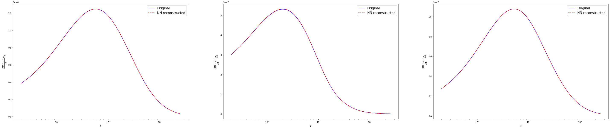
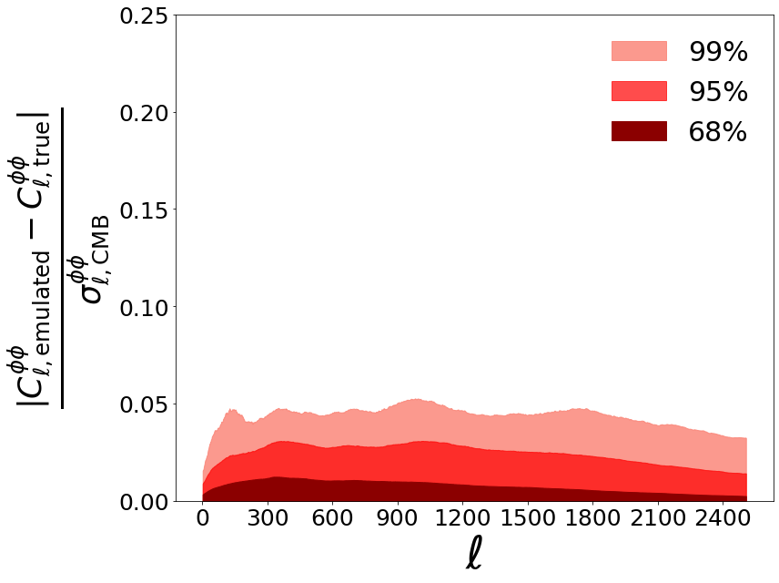

This section is an excerpt from the notebook explaining how to [train a ``cosmopower_PCAplusNN`` model](https://github.com/alessiospuriomancini/cosmopower_public/blob/main/notebooks/training_notebooks/cosmopower_PCAplusNN_CMB_training.ipynb). The user is strongly encouraged to run that notebook in its entirety, [](https://colab.research.google.com/drive/1G8vABcUk9yztXYDx8bDFaNhJrtVIA5ei?usp=sharing). Here we will consider only the most important parts to understand how the training works.


#### **PARAMETER FILES**

Let's take a look at the content of the parameter files that are read by ``CosmoPower`` during training.

```python
training_parameters_1 = np.load('./camb_pp_training_params_1.npz')
```

`training_parameters_1` is a `dict` of `np.arrays`. There is a `dict` key for each of the parameters the emulator is going to be trained on:


```python
print(training_parameters_1.files)
```

    ['omega_b', 'omega_cdm', 'h', 'tau_reio', 'n_s', 'ln10^{10}A_s']


Each of these keys has an associated `np.array` of values. The length of these arrays is the number of training samples in that file. Each file may have a different number of samples; their total number is the total number of samples in our training set. For example, let's check how many training samples are contained in the file we loaded:


```python
print(training_parameters_1['omega_b'])
print('number of training samples in this file: ', len(training_parameters_1['omega_b'])) # same for all of the other parameters
```

    [0.03959524 0.03194429 0.03467569 ... 0.03080418 0.01733493 0.03203036]
    number of training samples in this file:  15000


#### **FEATURE FILES** 

Now let's take a look at the "features". With features here we refer to the predictions of the neural network: these may be spectra or log-spectra values. In this case we are emulating values of the $\phi \phi$ _log_-power spectra. The corresponding `.npz` files contain a `dict` with two keys:


```python
training_features_1 = np.load('./camb_pp_training_log_spectra_1.npz')
print(training_features_1.files)
```

    ['modes', 'features']


The first key, `modes`, contains a `np.array` of the sampled Fourier modes. In this CMB case, the `modes` are the sampled $\ell$ multipoles; in the matter power spectrum case, `modes` would contain the sampled $k$-modes. In this specific example the log-power spectra are sampled at each multipole $\ell$ in the range $[2, \dots 2508]$, hence each training log-spectrum is a 2507-dimensional array.


```python
print(training_features_1['modes'])
print('number of multipoles: ', len(training_features_1['modes']))
```

    [   2    3    4 ... 2506 2507 2508]
    number of multipoles:  2507


The second key, `features`, has values equal to the actual values of the spectra. These are collected in a `np.array` of shape 

(number of training samples *in this file*, number of Fourier modes):


```python
training_log_spectra_1 = training_features_1['features']
print('(number of training samples in this file, number of ell modes): ', training_log_spectra_1.shape)
```

    (number of training samples in this file, number of ell modes):  (15000, 2507)


All of the other training features files have the same type of content, although the number of samples in each file may differ. The total number of samples in all of the training files represents the size of our training set.

The files for the testing samples also have the same type of content as the training ones.

```python
testing_params = np.load('./camb_pp_testing_params.npz')
testing_spectra = 10.**np.load('./camb_pp_testing_log_spectra.npz')['features']
```

### **`cosmopower_PCA` INSTANTIATION**

We will now create an instance of the ``cosmopower_PCA`` class, which will be used to perform PCA compression of the training spectra. This instance of the ``cosmopower_PCA`` will then be passed as an input to the ``cosmopower_PCAplusNN`` class, which implements the actual emulator of PCA components. 

In order to instantiate the ``cosmopower_PCA`` class, we will first need to define some of the key aspects of our model.

#### **PARAMETERS** 

Let's start by defining the parameters of our model. 

If, for example, we want to emulate over a set of 6 standard $\Lambda$CDM parameters,

$\omega_{\mathrm{b}}, \omega_{\mathrm{cdm}}, h, \tau, n_s, \ln10^{10}A_s$

we need to create a `list` with the names of all of these parameters, in _arbitrary_ order:     


```python
# list of parameter names, in arbitrary order
model_parameters = ['h', 
                    'tau_reio', 
                    'omega_b', 
                    'n_s', 
                    'ln10^{10}A_s', 
                    'omega_cdm', 
                    ]
```

This `list` will be sent in input to ``cosmopower_PCA``. In turn, a ``cosmopower_PCA`` instance will be fed to the `cosmopower_PCAplusNN` class, which will use the information on the parameters of our model: 

- to derive the *number* of parameters in our model, equal to the number of elements in `model_parameters`. This number also corresponds to the number of nodes in the input layer of the neural network;

- to free the user from the burden of having to manually perform any ordering of the input parameters.

The latter point guarantees flexibility and simplicity while using `cosmopower_PCAplusNN`: to obtain predictions for a set of parameters, the user simply needs to feed a Python `dict` to `cosmopower_PCAplusNN`, without having to worry about the ordering of the input parameters. 

For example, if I wanted to know the neural network prediction for a single set of parameters, I would collect them in the following `dict`:

```python
example_single_set_input_parameters = {'n_s': [0.96], 
                                       'h': [0.7], 
                                       'omega_b': [0.0225], 
                                       'omega_cdm': [0.13], 
                                       'tau_reio': [0.06], 
                                       'ln10^{10}A_s': [3.07], 
                                        }
```

Similarly, if I wanted to ask `cosmopower_PCAplusNN` for e.g. the predictions for 3 parameter sets, I would use:

```python
example_multiple_sets_input_parameters = {'n_s': np.array([0.96, 0.95, 0.97]), 
                                          'h': np.array([0.7, 0.64, 0.72]), 
                                          'omega_b': np.array([0.0225, 0.0226, 0.0213]), 
                                          'omega_cdm': np.array([0.11, 0.13, 0.12]), 
                                          'tau_reio': np.array([0.07,0.06, 0.08]), 
                                          'ln10^{10}A_s': np.array([2.97, 3.07, 3.04]), 
                                           }
```
The possibility of computing these batch predictions is particularly useful when ``cosmopower`` is integrated within samples that allow for batch evaluations of the likelihood.

#### **MODES**

A second, important piece of information for the `cosmopower_PCA` class is the number of sampled Fourier modes in our spectra, i.e. the number of multipoles $\ell$ for the CMB spectra, or the number of $k$-modes for the matter power spectrum.

In this example, we will emulate all of the $\ell$ multipoles between 2 and 2508. Note that we exclude $\ell=0,1$ as these are always 0. We can read the sampled $\ell$ range from the `modes` entry of our `training_features_1` dict (previously loaded):


```python
ell_range = training_features_1['modes']
print('ell range: ', ell_range)
```

    ell range:  [   2    3    4 ... 2506 2507 2508]


#### **NUMBER OF PCA COMPONENTS**

We also need to inform ``cosmopower_PCA`` of how many PCA components we want to keep:


```python
n_pcas = 64
```

#### **CLASS INSTANTIATION**
Finally, let's feed the information on model parameters, modes and number of PCA coefficients to the `cosmopower_PCA`class. We also need to input a ``list`` of
- ``parameters_filenames``: collecting all of the files with parameter samples from the training set;
- ``features_filenames``: collecting all of the files with feature samples from the training set.


```python
parameters_filenames = ['./camb_pp_training_params_1', './camb_pp_training_params_2', './camb_pp_training_params_3']
features_filenames = ['./camb_pp_training_log_spectra_1', './camb_pp_training_log_spectra_2', './camb_pp_training_log_spectra_3']
```


```python
from cosmopower import cosmopower_PCA

cp_pca = cosmopower_PCA(parameters=model_parameters,
                        modes=ell_range,
                        n_pcas=n_pcas,
                        parameters_filenames=parameters_filenames,
                        features_filenames=features_filenames,
                        verbose=True, # useful to follow the various steps
                        )
```

    
    Initialized cosmopower_PCA compression with 64 components 
    


### **PCA COMPRESSION**

The ``transform_and_stack_training_data`` method of the ``cosmopower_PCA`` class runs the full compression pipeline on the training data. Note that ``cosmopower_PCA`` internally performs [IncrementalPCA](https://scikit-learn.org/stable/auto_examples/decomposition/plot_incremental_pca.html), allowing it to process input data in batches - this is why we did not collect the training data in _one_ single file. Leaving the input data in multiple files allows for a reduced computational burden in terms of memory requirements.


```python
cp_pca.transform_and_stack_training_data()
```


### **``cosmopower_PCAplusNN`` INSTANTIATION**

After having performed PCA compression of the training set with the ``cosmopower_PCA`` class, we can now feed this class to the ``cosmopower_PCAplusNN`` class. The latter represents the actual emulator, mapping parameters onto PCA coefficients. Hence, in initialising ``cosmopower_PCAplusNN`` we can decide on details of the network architecture:


```python
from cosmopower import cosmopower_PCAplusNN

cp_pca_nn = cosmopower_PCAplusNN(cp_pca=cp_pca,
                                 n_hidden=[512,512,512,512], # 4 hidden layers, each with 512 nodes
                                 verbose=True, # useful to understand the different steps in initialisation and training
                                 )
```

    
    Initialized cosmopower_PCAplusNN model, 
    mapping 6 input parameters to 64 PCA components 
    and then inverting the PCA compression to obtain 2507 modes 
    The model uses 4 hidden layers, 
    with [512, 512, 512, 512] nodes, respectively. 
    


### **TRAINING**

In this section we will train our model. 

To do this, we will call the method `train()` from the `cosmopower_PCAplusNN` class.
Here are the input arguments for this function:

* `filename_saved_model`: path (without suffix) to the `.pkl` file where the trained model will be saved;

* `validation split`: `float` between 0 and 1, percentage of samples from the training set that will be used for validation.


Some of the input arguments allow for the implementation of a learning schedule with different steps, each characterised by a different learning rate. In addition to the learning rate, the user can change other hyperparameters, such as the batch size, at each learning step:

* `learning_rates`: `list` of `float` values, the optimizer learning rate at each learning step;

* `batch_sizes`: `list` of `float` values, batch size for each learning step;

* `gradient_accumulation_steps`: `list` of `int` values, the number of accumulation batches if using gradient accumulation, at each learning step. Set these numbers to > 1 to activate gradient accumulation - only worth doing if using very large batch sizes;

* `patience_values`: `list` of `int` values, the number of epochs to wait for early stopping, at each learning step;

* `max_epochs`: `list` of `int` values, the maximum number of epochs for each learning step.


```python
with tf.device(device):
    # train
    cp_pca_nn.train(filename_saved_model='PP_cp_PCAplusNN_example',
                    # cooling schedule
                    validation_split=0.1,
                    learning_rates=[1e-2, 1e-3, 1e-4, 1e-5, 1e-6],
                    batch_sizes=[1024, 1024, 1024, 1024, 1024],
                    gradient_accumulation_steps = [1, 1, 1, 1, 1],
                    # early stopping set up
                    patience_values = [100,100,100,100,100],
                    max_epochs = [1000,1000,1000,1000,1000],
                    )
```

The model is trained! If you are satisfied with its performance on the testing set (see next section) you can download the `.pkl` file where the model was saved (given by the `filename_saved_model` argument of the `train` method of the `cosmopower_PCAplusNN` class).

### **TESTING**

Let's load the trained model


```python
cp_pca_nn = cosmopower_PCAplusNN(restore=True, 
                                 restore_filename='PP_cp_PCAplusNN_example'
                                 )                                
```

Let's compute the predictions for the testing parameters. Note that we use the function `ten_to_predictions_np`, which, given input parameters,

* first performs forward passes of the trained model 
* and then computes 10^ these predictions.

Since we trained our model to emulate _log-spectra_, the output of `ten_to_predictions_np` is then given by predicted _spectra_.

**NOTE 1**: If we had trained our model to emulate spectra (without log), then to obtain predictions we would have used the function `predictions_np`.

**NOTE 2**: the functions `ten_to_predictions_np` and `predictions_np` implement forward passes through the network using only Numpy. These are optimised to be used in pipelines developed in simple Python code (not pure-Tensorflow pipelines). 

Conversely, the functions `ten_to_predictions_tf` and `predictions_tf` are pure-Tensorflow implementations, and as such are optimised to be used in pure-Tensorflow pipelines.

**NOTE 3**: both pure-Tensorflow and Numpy implementations allow for batch evaluation of input parameters - here, in particular, we can obtain predictions for all of the `testing_parameters` in just a single batch evaluation. 


```python
predicted_testing_spectra = cp_pca_nn.ten_to_predictions_np(testing_params)
```

Plot examples of power spectra predictions from the testing set


```python
fig, ax = plt.subplots(nrows=1, ncols=3, figsize=(50,10))
for i in range(3):
    pred = predicted_testing_spectra[i]*ell_range*ell_range*(ell_range+1)*(ell_range+1)/(2.*np.pi)
    true = testing_spectra[i]*ell_range*ell_range*(ell_range+1)*(ell_range+1)/(2.*np.pi)
    ax[i].semilogx(ell_range, true, 'blue', label = 'Original')
    ax[i].semilogx(ell_range, pred, 'red', label = 'NN reconstructed', linestyle='--')
    ax[i].set_xlabel('$\ell$', fontsize='x-large')
    ax[i].set_ylabel('$\\frac{[\ell(\ell+1)]^2}{2 \pi} C_\ell$', fontsize='x-large')
    ax[i].legend(fontsize=15)
```


    

    


We want to plot accuracy in units of Simons Observatory (SO) noise curves. 
Start by loading SO noise curves from [the SO repository](https://github.com/simonsobs/so_noise_models) 


```python
!git clone https://github.com/simonsobs/so_noise_models
```

```python
# load noise models from the SO noise repo
noise_levels_load = np.loadtxt('./so_noise_models/LAT_lensing_noise/lensing_v3_1_0/nlkk_v3_1_0deproj0_SENS1_fsky0p4_it_lT30-3000_lP30-5000.dat')
```


```python
ells = noise_levels_load[:, 0]
SO_PP_MV_noise = noise_levels_load[:, 7][:2507]
```


```python
new_ells = ells[:2507] # 2509 is the final for our spectra, starting from 2
SO_PP_MV_noise /= (new_ells*(new_ells+1)/2)**2 # convert from kappa_kappa to phi_phi
```


```python
f_sky = 0.4
prefac = np.sqrt(2/(f_sky*(2*new_ells+1)))
denominator = prefac*(testing_spectra+SO_PP_MV_noise)  # use all of them
diff = np.abs((testing_spectra - predicted_testing_spectra)/(denominator))

percentiles = np.zeros((4, diff.shape[1]))

percentiles[0] = np.percentile(diff, 68, axis = 0)
percentiles[1] = np.percentile(diff, 95, axis = 0)
percentiles[2] = np.percentile(diff, 99, axis = 0)
percentiles[3] = np.percentile(diff, 99.9, axis = 0)
```


```python
plt.figure(figsize=(12, 9))
plt.fill_between(new_ells, 0, percentiles[2,:], color = 'salmon', label = '99%', alpha=0.8)
plt.fill_between(new_ells, 0, percentiles[1,:], color = 'red', label = '95%', alpha = 0.7)
plt.fill_between(new_ells, 0, percentiles[0,:], color = 'darkred', label = '68%', alpha = 1)

plt.ylim(0, 0.25)

plt.legend(frameon=False, fontsize=30, loc='upper right')
plt.ylabel(r'$\frac{| C_{\ell, \rm{emulated}}^{\phi \phi} - C_{\ell, \rm{true}}^{\phi \phi}|} {\sigma_{\ell, \rm{CMB}}^{\phi \phi}}$', fontsize=50)
plt.xlabel(r'$\ell$',  fontsize=50)

ax = plt.gca()
ax.xaxis.set_major_locator(plt.MaxNLocator(10))
ax.yaxis.set_major_locator(plt.MaxNLocator(5))

plt.setp(ax.get_xticklabels(), fontsize=25)
plt.setp(ax.get_yticklabels(), fontsize=25)
plt.tight_layout()
```


    

    
